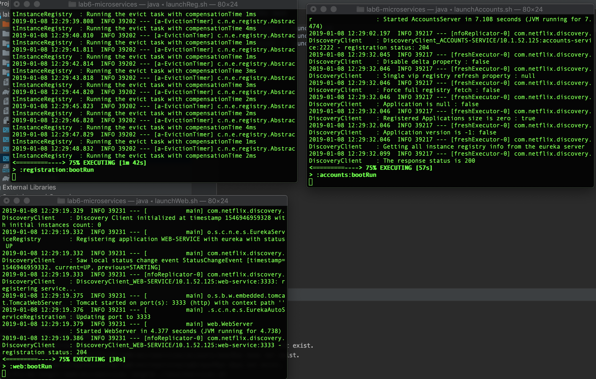
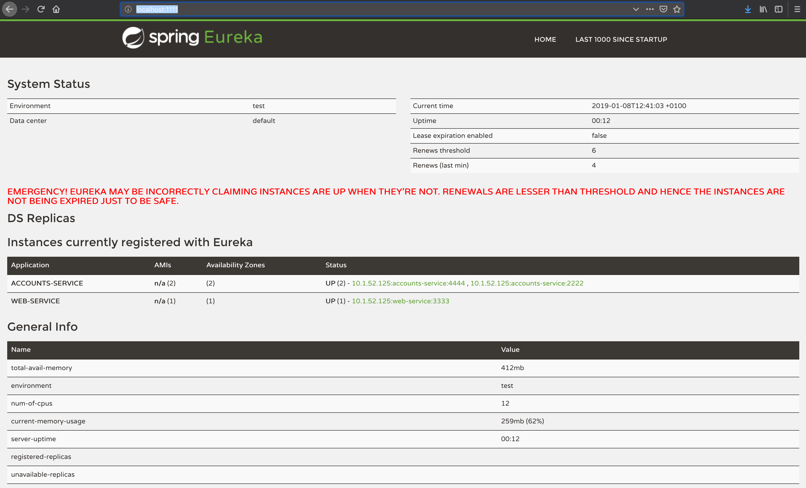
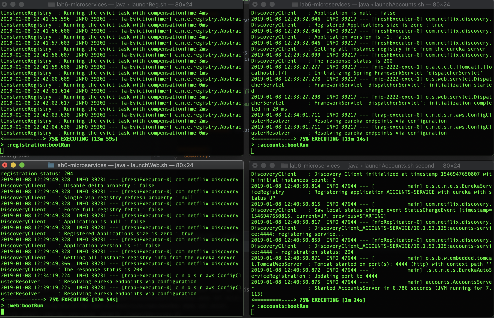
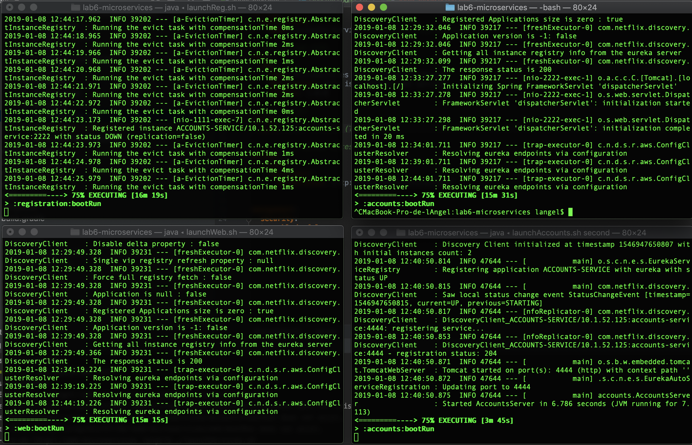
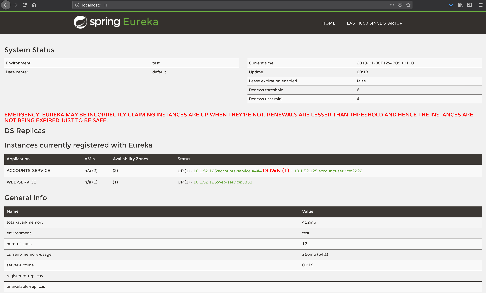

## Microservices web report

#### Launch services

The three services are running in port 1111 (Eureka), 2222 (accounts) and 3333 (web) and registered in Eureka as such.

#### Launch another service

As with parts 1-2, the new service has started in port 4444.

#### Kill an account service

Now, the first account service (the one running on port 2222) has been shutdown and unregistered from Eureka.

